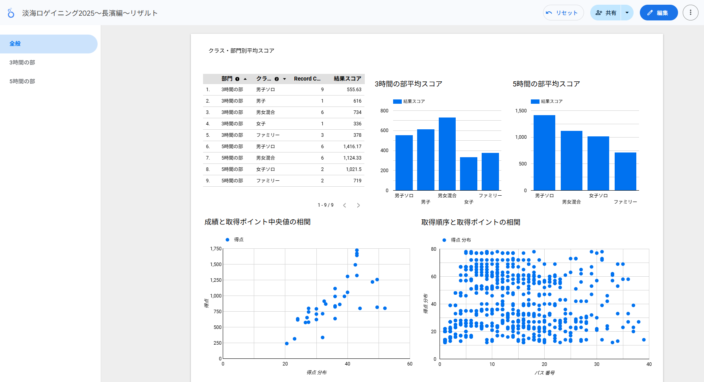
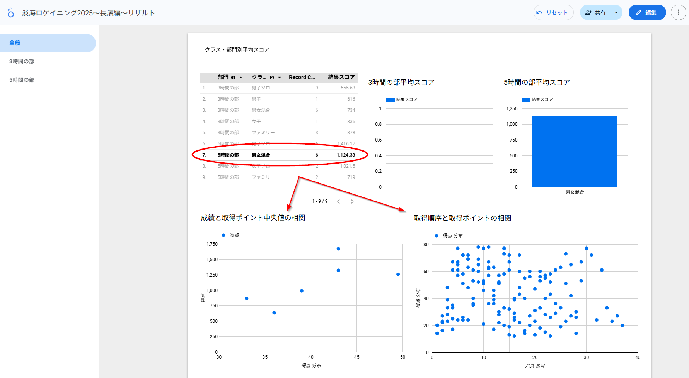
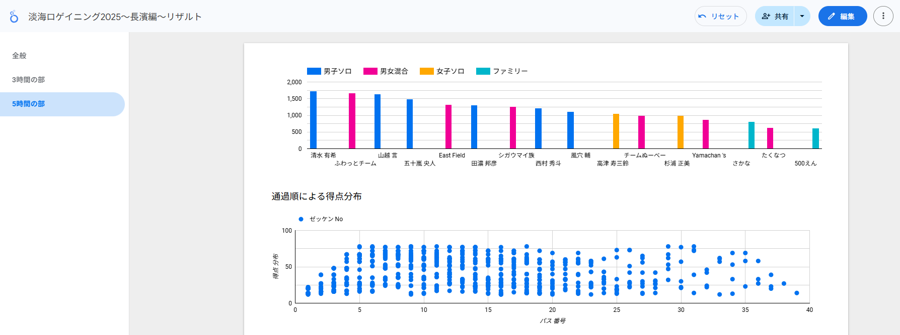
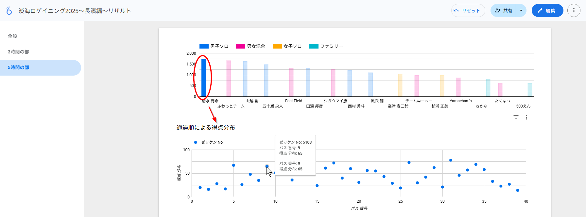

# ロゲイニング速報ボードの見方

## 全般タブ

部門・クラス毎の平均スコア
    : バーグラフで平均値が表示されます。

成績と取得ポイントの中央値の相関
    : チームの合計ポイントと、取得した得点群の中央値の関係を散布図でプロット。低いポイントを多く集めたのか、高いポイントを狙って取ったのか、の傾向が比較できます。

取得順序と取得ポイントの相関
    : 取得した順序を横軸として各チームが取得したポイントを散布図でプロット。クラス、部門毎にフィルタすることで、どの順序でポイントを取得したのかの傾向がわかります。

{align=center}

クラスをクリックすると

{align=center}

## 部門タブ

最初に各チームの合計ポイントをバーチャートで表示します。

またその下に取得した順序を横軸として各チームが取得したポイントを散布図でプロット。任意のチームのバーチャートをクリックするとそのチームだけの取得した順序が一覧されます。マーカにマウスを合わせると、取得ポイント、順序などのラベルが出現します。

{align=center}

{align=center}